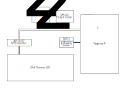

# Wall Display

A Python program for Raspberry Pi that reads atmospheric data from sensors and displays it on a character LCD. Shows date, time, temperature, humidity, pressure, and CO2 concentration.

## Hardware Diagram

## Log Format

All sensor readings are logged to a big-endian binary file called `logs/all_data.dat` as an array of 22-byte records. Each record's 8 fields are described below:

| offset | field name          | length (bytes) | type         | data source | quantity             | units       | notes |
|--------|---------------------|----------------|--------------|-------------|----------------------|-------------|-------|
| 00     | timestamp           | 4              | unsigned int | clock       | UTC Unix time        | seconds     | Python's [datetime module](https://docs.python.org/3/library/datetime.html) automatically handles converting system time [to](https://docs.python.org/3/library/datetime.html#datetime.datetime.timestamp) and [from](https://docs.python.org/3/library/datetime.html#datetime.datetime.fromtimestamp) UTC unix timestamps. Treat is as unsigned and it lasts until 2106. |
| 04     | dps310_pressure_hPa | 4              | float        | DPS310      | atmospheric pressure | hPa         | single-precision is more than enough to represent the sensor's advertised ±0.002 hPa precision |
| 08     | dps310_temp_c       | 4              | float        | DPS310      | temperature          | °C          | single-precision is more than enough to represent the sensor's advertised ±0.5°C precision |
| 0C     | scd40_co2           | 2              | int          | SCD40       | CO2 concentration    | ppm         | |
| 0E     | scd40_temp_bin      | 2              | unsigned int | SCD40       | temperature          | (see notes) | To convert to temperature in °C: `-45 + 175 * scd40_temp_bin / 2**16` To convert temperature in °C to stored value: `int(2**16 * ((scd40_temp_c + 45) / 175))` (This is the same format transmitted by the sensor. See table 11 on page 9 of the datasheet.) |
| 10     | scd40_humid_bin     | 2              | unsigned int | SCD40       | relative humidity    | (see notes) | To convert to relative humidity percentage: `100 * scd40_humid_bin / 2**16` To convert %rH to stored value: `int(2**16 * (scd40_humid / 100))` (This is the same format transmitted by the sensor. See table 11 on page 9 of the datasheet.) |
| 12     | dht22_temp_c_10     | 2              | int          | DHT22       | temperature          | (see notes) | To convert to temperature in °C: `dht22_temp_c_10 / 10` To convert temperature in °C to stored value: `int(10 * dht22_temp_c)` (The sensor uses a 1 decimal fixed-point representation) If the sensor had an error, the value will be `0x7FFF` instead. |
| 14     | dht22_humid_10      | 2              | int          | DHT22       | relative humidity    | (see notes) | To convert to relative humidity percentage: `dht22_humid_10 / 10` To convert temperature in °C to stored value: `int(10 * dht22_humid)` (The sensor uses a 1 decimal fixed-point representation) If the sensor had an error, the value will be `0x7FFF` instead. |

The Python [struct format string](https://docs.python.org/3/library/struct.html#format-strings) for this format is `">LffhHHhh"`.
